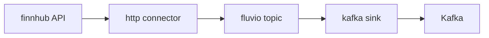
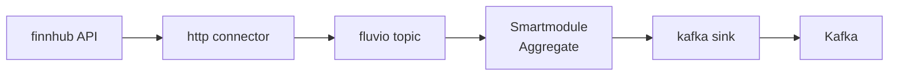

# Start 
Install minikube, helm, kubectr [following instructions](https://www.fluvio.io/docs/get-started/linux/#installing-kubernetes-cluster)
* minikube start
# Install Fluvio

```bash
curl -fsS https://packages.fluvio.io/v1/install.sh | bash
```
start fluvio cluster
```bash
fluvio cluster start
```
Verify cluster is running:
```
fluvio topic create greetings
echo "Hello, Fluvio" | fluvio produce greetings
fluvio consume greetings -B -d
```
# Start local Kafka dev
Start Kafka
```
docker compose -f docker-compose-webinar.yml up -d
```
Kafka ADV_HOST is pinned to minikube network gateway 192.168.49.1:
```
minikube ip
192.168.49.2
```
Validate that Kafka is working
```
docker run --rm -it --net=host lensesio/fast-data-dev kafka-topics --zookeeper localhost:2181 --list
```
# Part one

# Recap of Finance Demo
* git clone https://github.com/infinyon/fluvio-demo-04-12-2022-finance-demo.git
* register on finhub.io and obtain api token 
* update API token in 
    * quote-data-input.yaml

Create a HTTP connector
Check if the fluvio topic populated
```
fluvio consume gme-stocks -B
```
# Write to Kafka from Fluvio topic

Clone https://github.com/infinyon/kafka_webinar_16_August_2022

Change the value ADV_HOST in `docker-compose-webinar.yml` and 'kafka_url' in `webinar-kafka-sink-connector.yml`  to local ip (`ifconfig| grep inet` for linux)


```bash
docker-compose -f docker-compose -f docker-compose-webinar.yml up
fluvio connector create -c ./webinar-kafka-sink-connector.yml
fluvio connector logs -f my-kafka-sink1
```
# Part two

# Apply Smart Module to fluvio topic before writing to Kafka

In `fluvio-demo-04-12-2022-finance-demo` folder run

```bash
make sm-upload
make produce-warrants
make sm-consume
```
Those commands will compile and upload a smart module. Produce warrants will generate purchase orders so current profit can be calculated.

## Start Kafka sink connector with smartmodule
```bash
fluvio connector create -c ./webinar-kafka-sink-connector-with-sm.yml
```
Rerun produce warrants:
In `fluvio-demo-04-12-2022-finance-demo` run

```bash
make produce-warrants
```

Sink connector read fluvio topic from the end, and we are re-running `make produce-warrants` to make sure fluvio topic is populated, which is then appearing in kafka-aggregate-fluvio. 

Watch kafka topic via Web UI
`http://localhost:3030/kafka-topics-ui/#/cluster/fast-data-dev/topic/n/kafka-aggregate-fluvio/`

or via command line:
```bash 
docker run --rm -it --net=host landoop/fast-data-dev kafka-console-consumer --topic kafka-aggregate-fluvio --bootstrap-server "192.168.1.89:9092"
```

# Notes

Running Kafka commands:
```bash
docker run --rm -it --net=host landoop/fast-data-dev kafka-topics --zookeeper localhost:2181 --list
```
```bash
docker run --rm -it --net=host landoop/fast-data-dev kafka-console-consumer --topic kafka-aggregate-fluvio --bootstrap-server "192.168.49.1:9092"
```
